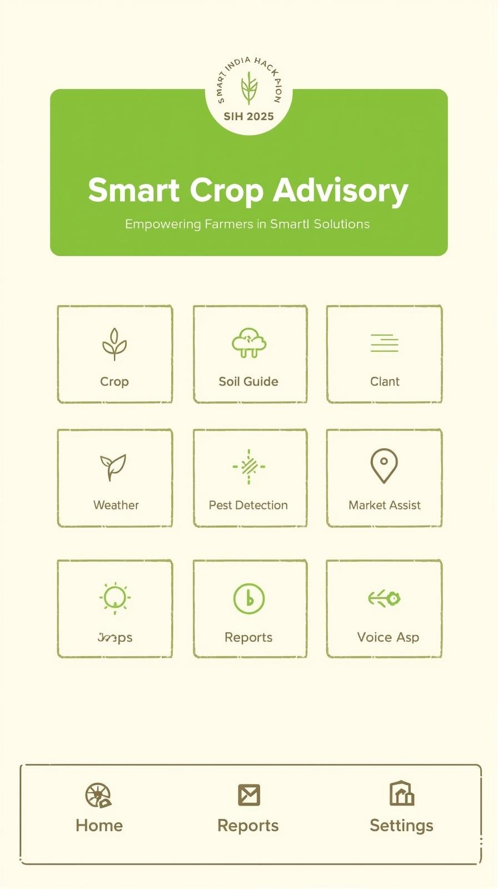
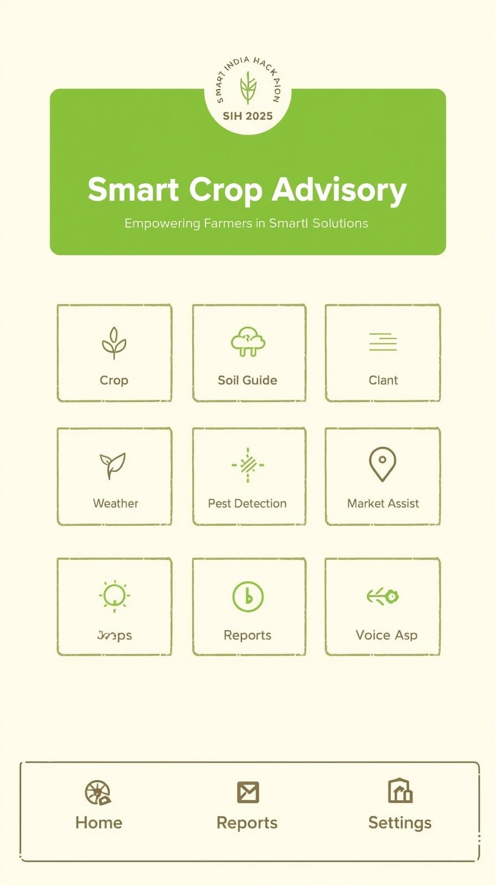

# Smart India Hackathon Workshop
# Date:29/09/25
## Register Number:25016839
## Name:Karkie F
## Problem Title
SIH 25010: Smart Crop Advisory System for Small and Marginal Farmers
## Problem Description
A majority of small and marginal farmers in India rely on traditional knowledge, local shopkeepers, or guesswork for crop selection, pest control, and fertilizer use. They lack access to personalized, real-time advisory services that account for soil type, weather conditions, and crop history. This often leads to poor yield, excessive input costs, and environmental degradation due to overuse of chemicals. Language barriers, low digital literacy, and absence of localized tools further limit their access to modern agri-tech resources.

Impact / Why this problem needs to be solved

Helping small farmers make informed decisions can significantly increase productivity, reduce costs, and improve livelihoods. It also contributes to sustainable farming practices, food security, and environmental conservation. A smart advisory solution can empower farmers with scientific insights in their native language and reduce dependency on unreliable third-party advice.

Expected Outcomes

• A multilingual, AI-based mobile app or chatbot that provides real-time, location-specific crop advisory.
• Soil health recommendations and fertilizer guidance.
• Weather-based alerts and predictive insights.
• Pest/disease detection via image uploads.
• Market price tracking.
• Voice support for low-literate users.
• Feedback and usage data collection for continuous improvement.

Relevant Stakeholders / Beneficiaries

• Small and marginal farmers
• Agricultural extension officers
• Government agriculture departments
• NGOs and cooperatives
• Agri-tech startups

Supporting Data

• 86% of Indian farmers are small or marginal (NABARD Report, 2022).
• Studies show ICT-based advisories can increase crop yield by 20–30%.

## Problem Creater's Organization
Government of Punjab

## Theme
Agriculture, FoodTech & Rural Development

## Proposed Solution
<h3>Proposed Solution</h3>
<ul><li>The solution is to build a simple mobile app that gives farmers advice in their own language. It will suggest which crop to grow, how much fertilizer to use, and how to control pests. Farmers can upload photos of their crops to detect diseases. The app will also provide weather updates, market prices, and voice support for farmers who cannot read.
</li>
<li>It will suggest which crop to grow, how much fertilizer to use, and how to control pests. </li>
<ul><li> Farmers can upload photos of their crops to detect diseases. The app will also provide weather updates, market prices, and voice support for farmers who cannot read.

</li></ul>

## Technical Approach
<h3>Technical Approach</h3>
<ul><li>Mobile app (Android) for farmers
Simple AI for crop and pest advice
Database to store farmer details and crop history
Weather and market price data from online sources (APIs)
</li>
<li> Steps:

Farmer enters soil and crop details.
App gives advice on crop and fertilizer.
Farmer uploads crop photo → app checks for pests.
App shows results in local language with voice option.
Farmers get alerts about weather and market prices.
</li></ul>
## Feasibility and Viability
<h3>Feasibility and Viability</h3>
<ul><li>Feasible: Most farmers now have smartphones</li>
<li>Challenges: Some farmers may not know how to use apps, and internet is weak in villages.
</li>
<li>Solutions: Add offline mode, voice support, and conduct training workshops in villages</li></ul>

## Impact and Benefits
<h3>Impact and Benefits</h3>
<ul><li>Potential Impact on the Target Audience:
Increased access to scientific and reliable farming advice in local languages
Improved decision-making leading to higher productivity and profitability
Reduced dependency on middlemen and unreliable sources of information</li>
<li>Social: Farmers will feel more confident and independent.
Economic: Better yield, less cost, and more income.
Environmental: Less chemical use, more sustainable farming.
</li></ul>

## Research and References
<h3>Research and References</h3>
<ul><li>NABARD Report, 2022 – Data on small and marginal farmers in India
FAO studies on ICT-based agricultural advisories
Government of India reports on digital agriculture initiatives</li></ul>
